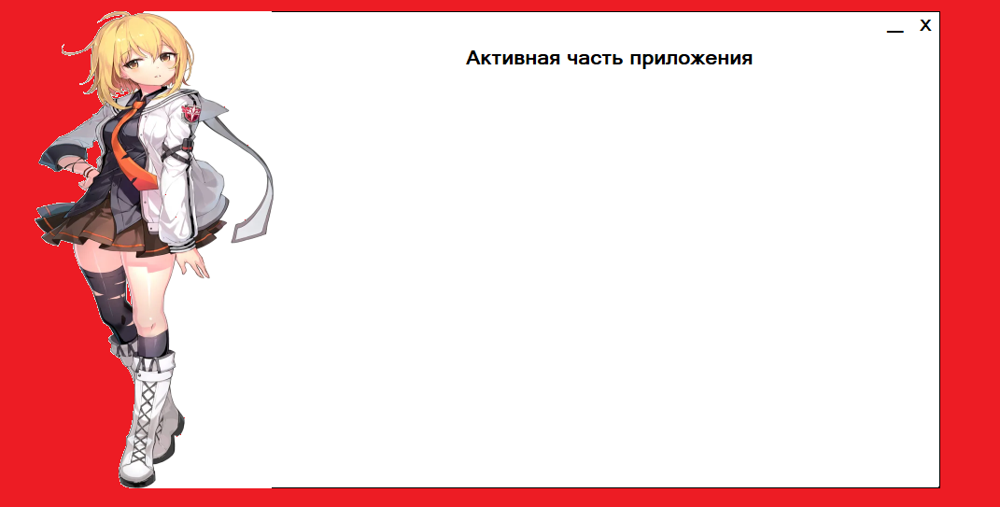

# WinFormsWithTransparentBackground
Windows Form With Transparent Background and Image out of Form + All "WPF Shell" contruction

Данный проект содержит в себе пример той формы, которую можно сделать при помощи только Windows Forms.
BorderStyle = None. Верхняя панель сделана программно. Так же как и возможность растягивать панель. 
Так же, была добавлена картинка выходящая за рамки формы, что придаёт ей необычности.
В данном репозитории вы можете найти примеры как создать такую форму.

